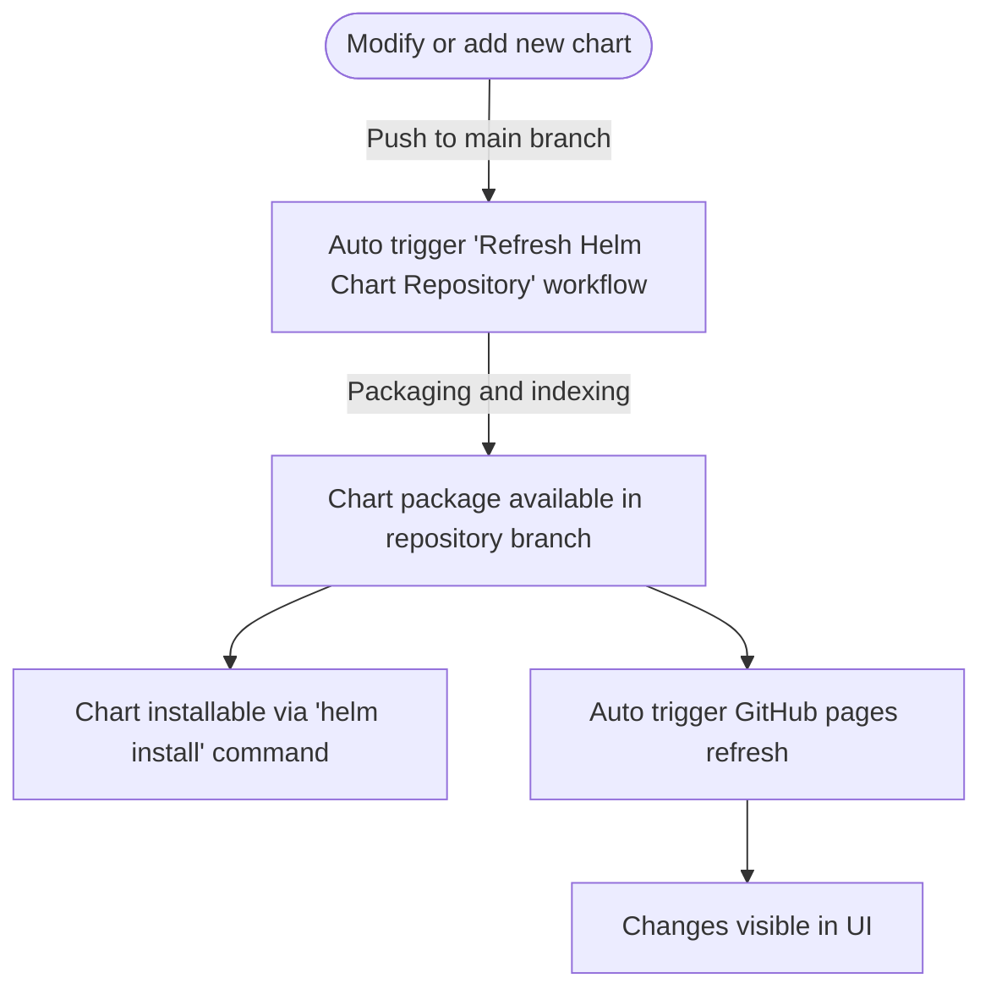

# Ready to use Helm Chart Repository Template
:green_book: Detailed article covering the repository is available [here](https://medium.com/@karparov/helm-chart-repository-in-github-a-few-clicks-are-all-you-need-9183f7df2bde)

## :gem: What you will get
- **Repository for Helm Charts Source Code:** The main branch of the repository, where you can manage and update the source code for your Helm charts.
- **Repository for Helm Charts Archives:** The repository branch of the repository, dedicated to storing the packaged Helm charts (archives).
- **User Interface:** A hosted UI on GitHub Pages that provides instructions on how to add the Helm Chart repository and how to install each of the available charts.
- **Continuous Refresh:** Automatic updates to the Helm Chart repository and the UI triggered by any changes in the source code branch (e.g., modifying or adding new charts).

## :white_check_mark: How to get it 
1. Click "Use this template" in the upper right corner then "Create new repository"
2. Click "Include all branches" :exclamation:
3. Choose "Repository name"
4. Click "Create repository"
5. After the repository is created, click "Settings"
6. Click "Pages"
7. In the "Branch" section, select "repository"
8. Click "Save"
9. Finally, click "Actions" and observe the running jobs.
10. After less than a minute the github pages endpoint will be active (navigate to the pages build and deployment job to find the URL).

The generated repository UI will look exactly like https://karparov.github.io/helm-chart-repository-template/ but following updates on your newly generated repository

## Adding or modifying Helm charts

The following diagram explains the process of adding or modifying Helm Charts in the repository:

