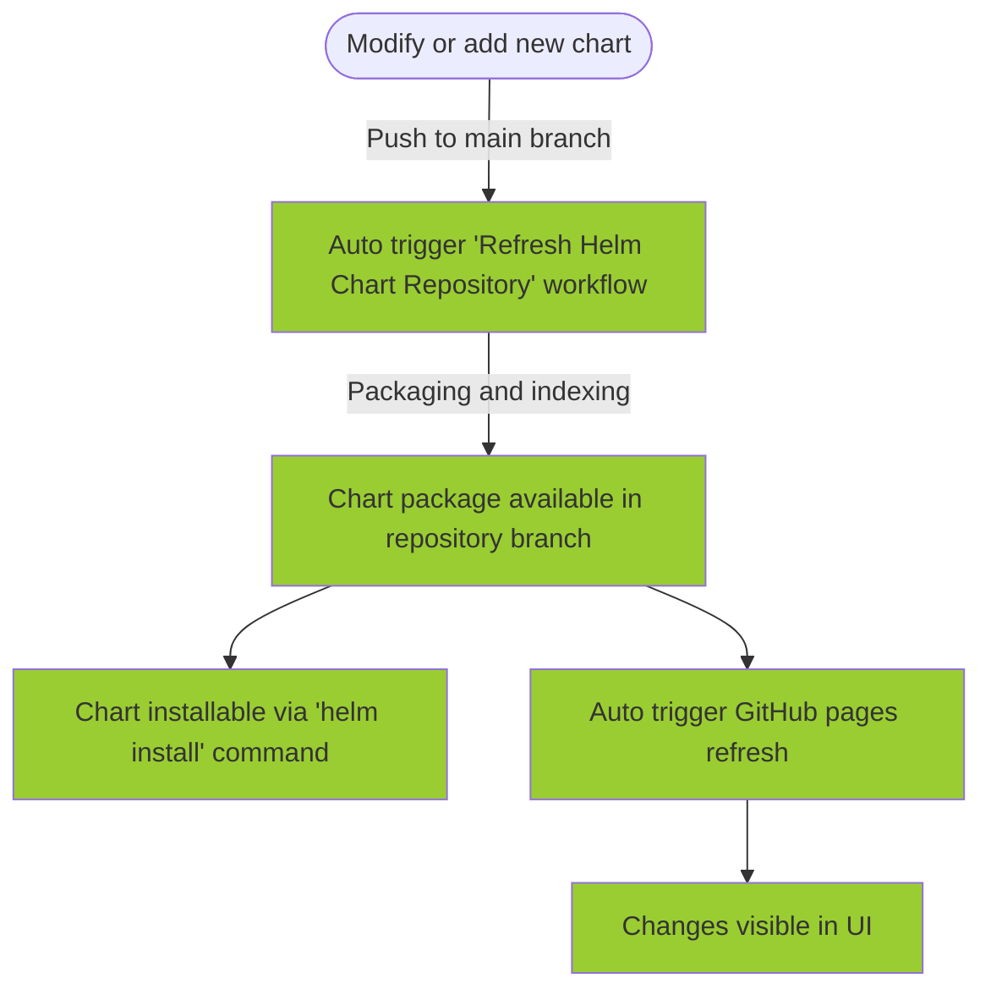

# Ready to use Helm Chart Repository Template

## :gem: What you will get
1. Repository for Helm Charts source code - the "main" branch of this repository
2. Repository for Helm Charts archives (packaged charts) - the "repository" branch of this repository
3. UI, having instruction how to add the Helm Chart repository and how to install each of the available charts - hosted in github pages
5. Continuous refresh of the Helm Chart repository and the respective UI triggered by a change in the source code branch (e.g. modifying or adding new chart)

## :white_check_mark: How to get it 
1. Click "Use this template" in the upper right corner then "Create new repository"
2. Click "Include all branches" :exclamation:
3. Choose "Repository name"
4. Click "Create repository"
5. After the repository is created, click "Settings"
6. Click "Pages"
7. In the "Branch" section, select "repository"
8. Click "Save"
9. Finally, click "Actions" and observe the running jobs.
10. After less than a minute the github pages endpoint will be active (navigate to the pages build and deployment job to find the URL).

The generated repository UI will look exactly like https://karparov.github.io/helm-chart-repository-template/ but following updates on your newly generated repository

## Adding or modifying Helm charts

The following diagram explains the process of adding or modifying Helm Charts in the repository:

